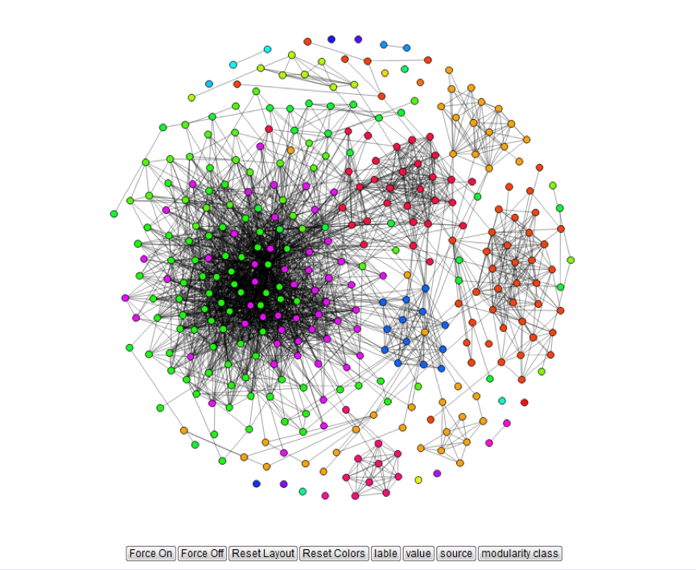
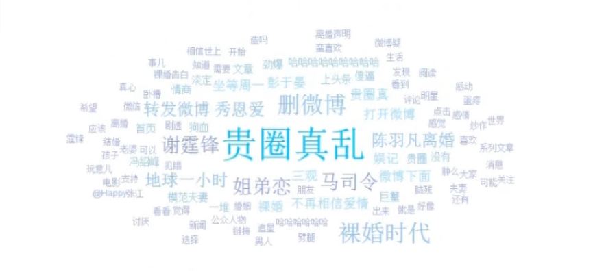
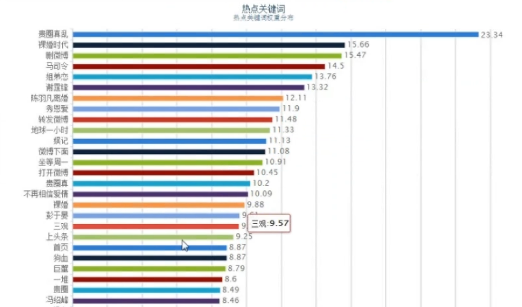
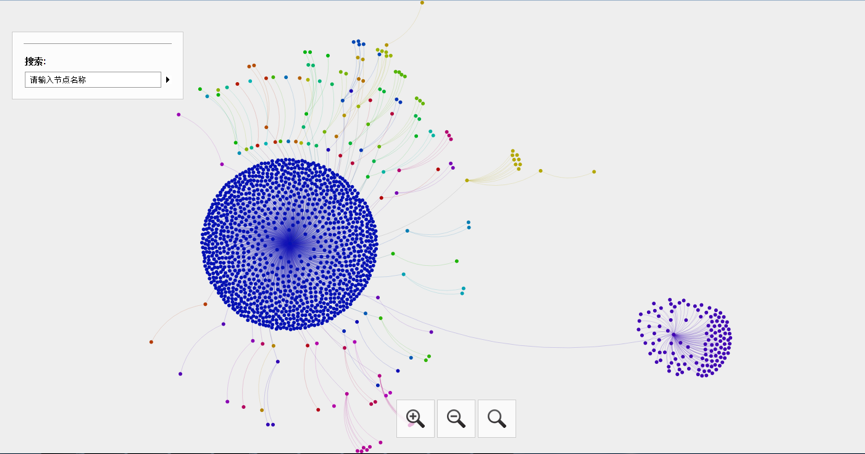

# Weibo Social Network Visualization
This project is based on the gephi network analyzing library and sigma/echarts javascript charts, which is able to discover the user community and hot topics from the Weibo social network platform.

## Notice
It is built five years ago, and therefore some functions may be deprecated.

## Demo
1. Community detection

2. Hot Topic Discovery

 

3. Topic propagation

